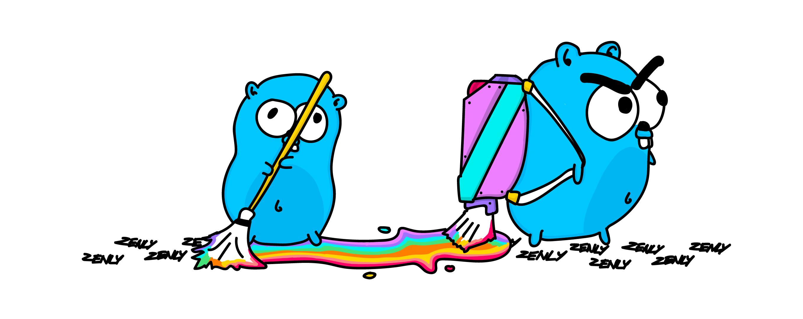

<p align="center">
	
</p>
---

# strobfus
*strobfus* provides a simple tool to obfuscate sensible strings inside Go binaries, when you have no other choice but to put them there.
```
$ go get -u github.com/znly/strobfus
```
## Usage
Place your sensible strings inside a dedicated file with the right `go generate` clause, e.g.:
```go
// +build ignore

package api
//go:generate strobfus -filename $GOFILE
var API_KEY = "MY_API_KEY"
```

*(Note the `// +build ignore` directive, you obviously don't want those strings to end up in your binary)*
Upon generation, *strobfus* will create a new file (`${filename}_gen.go`, by default) that contains each string in a properly encrypted form, using AES-128 with a random key.  
That same key is stored in the generated file too, and will be used to decrypt the content of each string at run time (via `init()`).

## Good to know

*strobfus* is just a deterrent that prevents kind-of sensible data from appearing in clear form in the output of binary analysis tools such as `objdump`, `strings`, etc.  
It is **not** a security measure per-se; anyone experienced with the use of a debugger should be able to retrieve the AES key from the final executable.

## Authors
See [AUTHORS](./AUTHORS) for the list of contributors.

## License 
The Apache License version 2.0 (Apache2) - see [LICENSE](./LICENSE) for more details.
Copyright (c) 2018  Zenly   <hello@zen.ly> [@zenlyapp](https://twitter.com/zenlyapp)